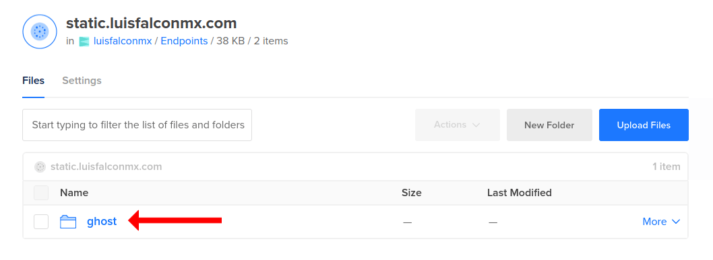

<p align="center">
  
</p>

<h3 align="center">Best headless cms blog platform</h3>
<h4 align="center">Ghost is the fast, modern WordPress alternative, focused completely on professional publishing.</h4>
<br>
<p align="center">
  
  <a href="https://google.com">
    
  </a>
</p>

<br><br>

<p align="center">
  
</p>

<br><br>

# Getting Started

Este proyecto esta enfocado en utilizar ghost unicamente. La base de datos y el servidor de almacenamiento de archivos estaticos se utilizaran como microservicios. Digitalocean Spaces será el microservicio necesario para poder utilizar la imagen de docker.

Para iniciar tu proyecto con ghost simplemente puedes utilizar el siguiente comando pasando los valores a cada variable de entorno definida. Mira la seccion de requerimientos en este documento para que logres configurar cada valor necesario.

```
docker run -d --name ghost -p 2368:2368 \
-e url= \
-e database__client=mysql \
-e database__connection__host= \
-e database__connection__user= \
-e database__connection__port= \
-e database__connection__password= \
-e database__connection__database= \
-e GHATA_CONFIG=config.production.json \
-e GHATA_ENDPOINT= \
-e GHATA_BUCKET= \
-e GHATA_SUBDOMAIN= \
-e GHATA_PATH= \
-e GHATA_KEY= \
-e GHATA_SECRET= \
luisfalconmx/ghost:latest
```

<br>

### Requerimientos

Para poder utilizar la imagen de este proyecto se necesitan cumplir los siguientes requerimientos.

- Docker instalado en tu computador o en tu servidor.
- Docker compose instalado en tu computador.
- Una cuenta en digitalocean.
- Un dominio
- Un servidor de MySQL 5.7 o 8

<br>

### Crear un space en digitalocean

El microservicio principal que usaremos es digitalocean spaces. Este nos servira para alojar todos los archivos estaticos en una cdn. Para lograr esto primero vamos a nuestro panel de digitalocean, damos clic en el boton verde que dice create y seleccionamos Spaces.


<br>
Seleccionamos la region del datacenter de nuestra preferencia.


<br>
Habilitaremos el Content Delivery Network para que nuestros archivos estaticos sean servidos desde multiples servidores. Para este paso es necesario que agreges tu dominio a digitalocean y lo selecciones en el campo "Use a custom subdomain". Podrás usar directamente el dominio o si especificas un subdominio digitalocean lo creara por ti.

En la opción "Allow file listing?" es recomendable seleccionar "Restrict File Listing" para que solo las aplicaciones de nuestra propiedad puedan listar los contenidos del space.


<br>

Para finalizar simplemente le damos un nombre a nuestro space. Seleccionamos el proyecto y damos clic en el boton de crear. (me sale el mensaje en rojo por que ya lo tenia creado)


<br>

### Obtener las credenciales del Space

Una vez que tenemos el space creado ahora vamos a obtener cada uno de los valores que necesitamos para correr la imagen de docker de este proyecto.

Primero vamos a abrir el space que creamos para ver sus detalles.


Ahora damos clic en settings.


Y copiamos el endpoint.


Con esto obtendremos la variable `GHATA_ENDPOINT=nyc3.digitaloceanspaces.com` - Recuerda utilizar tu endpoint.

---

Ahora podremos obtener la siguiente variable directamente del nombre del space.

` GHATA_BUCKET=static.luisfalconmx.com` - Recuerda utilizar el nombre de tu space


---

Ahora para la siguiente variable tendremos que ir dentro del space a `settings > cdn` donde encontraremos el dominio o subdominio que utilizamos.


`GHATA_SUBDOMAIN=static.luisfalconmx.com` - Recuerda usar tu dominio o subdominio.

---

Para la variable `GHATA_PATH` simplemente pondremos el nombre del directorio donde se almacenaran los archivos. Por ejemplo

`GHATA_PATH=ghost` - Recuerda poner tu directorio preferido



---

Para las variables `GHATA_KEY` y `GHATA_SECRET` vamos a API.


Vamos a la seccion Spaces and keys y damos clic en "Generate New Key"


Al ponerle un nombre para identificar la api generada obtendremos las llaves.


`GHATA_KEY=***` - Recuerda usar tu key

`GHATA_SECRET=***` - Recuerda usar tu secret

<br>

### Obtener las credenciales de MySQL

En los requerimientos se especifico que necesitamos un servidor de mysql 5.7 o 8. Este nos servira para poder almacenar nuestros posts.

En esta guia no cubriremos el paso a paso de como crear un servidor de mysql pero te dejo un articulo oficial de digitalocean para que puedas crearlo.

<br>

### Obtener las credenciales de las bases de datos autoadministradas

Si usas las bases de datos autoadministradas de digitalocean tendras en tu panel las credenciales que necesitas para conectarte pero antes tendras que configurar dos cosas.

1 - Se debera crear un nuevo usuario con la opcion "Password Encryption" en "Legacy - MySQL 5.x"


2 - Necesitaras modificar la variable de mysql `sql_require_primary_key` al valor `sql_require_primary_key = off` pero este proceso no lo podrás hacer por tu cuenta. Tendras que abrir un ticket en soporte de digitalocean solicitando este cambio.

Una vez que cumplas los pasos anteriores podremos usar los siguientes datos para usarlas en las variables de entorno.


Con los datos anteriores podremos llenar los datos de la siguiente manera. Recuerda usar los datos de tu servidor de mysql.

```
-e database__client=mysql \
-e database__connection__host=db-mysql-nyc1-50829-do-user-8682229-0.b.db.ondigitalocean.com \
-e database__connection__user=dummy \
-e database__connection__port=25060 \
-e database__connection__password=***** \
-e database__connection__database=dummy \
```
