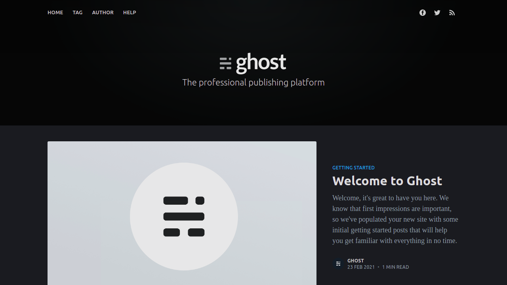

<p align="center">
  
</p>

<h2 align="center">Best headless blog platform</h2>
<h3 align="center">Ghost is the fast, modern WordPress alternative, focused completely on professional publishing.</h3>
<br>
<p align="center">
  
  <a href="https://google.com">
    
  </a>
</p>

<br><br>

<p align="center">
  
</p>

<br><br>

# Get Started

## Docker

Docker Run command

```
docker run -d --name ghost -p 2368:2368 \
-e url= \
-e database__client= \
-e database__connection__host= \
-e database__connection__user= \
-e database__connection__port= \
-e database__connection__password= \
-e database__connection__database= \
-e GHATA_CONFIG= \
-e GHATA_ENDPOINT= \
-e GHATA_BUCKET= \
-e GHATA_SUBDOMAIN= \
-e GHATA_PATH= \
-e GHATA_KEY= \
-e GHATA_SECRET= \
luisfalconmx/ghost
```

## Docker compose
